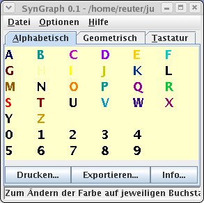
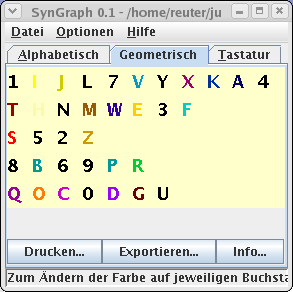
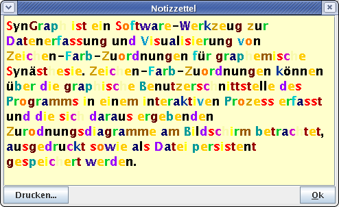
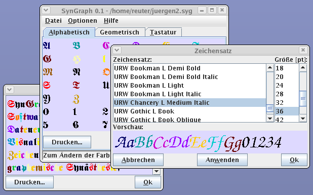

SynGraph
========

SynGraph is a software tool for capturing and visualizing data on symbol-to-color mappings.  It was designed and developed in preparation for a scientific psychological study on graphemic synaesthesia.  So far, I had no opportunity to carry out the study.  I encourage interested researchers to build upon my software tool and work out and carry out a proper psychological study.

Object of Investigation
-----------------------

Synaesthetic phenomena are typically characterized by a mapping of sensory impressions between affected senses.  According to state-of-the-art opinion in research on synaesthesia, there is no intra-individual variability over time in the mapping, while there is inter-individual difference between mappings.  Actually, some researchers assume that the mapping of different synaesthetic individuals may diverge so much that they even can not comprehend each other's mapping.

Synaesthetic individuals often tend to document their mapping of senses, if feasible.  There are many self-made colored drawings of individuals with graphemic synaesthesia that seem to support the hypothesis of inter-individual difference between mappings.  For example, while one individual may perceive the letter A as a red symbol, a different individual may perceive the same letter as green.  Similar observations can be shown for digits.

However, there are special border cases that seem to fall off from the rule of inter-individual difference.  For example, when asked for the color of digit “0”, most individuals with graphemic synaesthesia tend to respond with the answer “transparent”, even though transparency is not even a color.  Also, there seem to be some accumulations of specific mappings standing out of stastical noise, such as mapping the digit “5” to the color red, though this correlation does not seem to have been statistically proven or otherwise been further investigated.

The SynGraph software tool has been designed to support psychological studies that strive to investigate for such correlations and to clarify if there are inter-individual similarities in the mapping — in contrast to current teaching.  In particular, the tool enables probands to easily and playfully persue their desire to document their individual graphemic mapping of senses.  With the tool, virtually any Unicode character can be mapped to a specific RGB color, and the tool can display sets of characters configured to be displayed in an ordered manner, such as by geometric shape or associated phonemes.

Basic Properties of the Software
--------------------------------

Symbol-to-color mappings can be interactively entered into the software through its graphical user interface; the resulting diagrams can be viewed on screen, printed to paper in high resolution as well as permanently stored on disk. The diagrams offer multiple views for exploring patterns or structural rules for a given assignment of colors to symbols.

As of its current version 0.2, the software particularly supports the following basic functionality.

### Data Capturing

Capturing object-color mappings can be interactively performed on screen with mouse and keyboard input by choosing an individual color for each object in a diagram. Objects are represented by character strings, including single letters and digits. Captured data is stored in a simple, XML based file. This file and any other associated resources are compressed and saved in an archive, following the .zip file format. Having collected graphemic data from multiple people, the simple file format makes it easy to further process the data for analytical studies. For example, external additional tools could be applied in order to automatically compute a statistic evaluation of the object-color mappings of a larger number of probationers, in order to reveal similarities and differences in their individual mappings. A typical result could be the finding that people who perceive the letter A in red color, tend to perceive the letter I in yellow or white color.

### Comparing Representation of Selected Criteria of Order

The program also enables the user to graphically verify hypothetical inclinations of mappings. To achieve this goal, the program groups objects in tabbed panes, placed according to specific similarity criteria (cp. Fig. 1), for example by ordering capital letters and digits by their geometrical form, assuming a classical sans serif font for the notion of geometrical form of characters. Further criteria for ordering are imaginable, such as phonetic similarity of words or letters, similarity of muscles activated upon speaking (anatomic similarity), sorting of letters according to the order pupils learn them in school, or sorting of letters according to their frequency in natural language. The tabbed panes enable the user to directly visually compare and value such orderings and their correspondence to their individual object-color mappings. Moreover, by comparing the diagrams in the tabbed pane, the probationer can immediately recognize how far pure reordering of characters influences the colored perception of objects.

Fig. 1: Object-Color Mappings based on Various Criteria of Ordering

### Personally Colored Note Pad

The coloured notepad displays arbitrary texts according to the object-color mapping of characters. The text can be manually entered or cut-&-pasted into the pad, displayed, printed, or saved as image. This way, the characteristics of an individual person's graphemic synaesthesia can be nicely illustrated as well as used for validation of the user's specification of character-color mapping.

Fig. 2: Colored Note Pad

### Miscelleanous Properties

The software also supports selecting the font and character size to be used for display, as well as the background color (cp. Fig. 3). Committing a change of such a property in one window immediately affects display in all other simultaneously opened windows.

Fig. 3: Miscelleanous Properties

Current Limitations
-------------------

Currently, the software supports only few forms of synaesthesia reaching beyond pure character-color mappings. Mappings from character strings to colors are partially supported. The set of missing features most notably contains multi-colored or textured objects; consideration of contextual influence of neighbouring colored objects (e.g. colored letters within a word); and objects beyond characters and strings. The supported set of colors currently is based on the standard RGB color model; transparent or metallic colors are not supported by now.

Download
--------

If you are a software developer, you probably want to get the latest source code by downloading this repository.

Otherwise, you probably want to directly get the latest precompiled binary (Java .jar file) from [here](https://github.com/soundpaint/binaries/blob/master/syngraph-2008-01-04.18-55-36.jar).

Install and run
---------------

For installing, just download the precompiled binary (see above section) and save it on your computer whereever you find it appropriate.

For running the compiled binary (Java .jar file), you need to have a Java Runtime Environment (JRE) installed, at least version 5 (or JDK 1.5 or higher).  Depending upon your operating system, just double-click on the binary to execute it or envoke the Java interpreter with the binary file as argument.

Further Reading
---------------

The following references on synaesthesia may be interesting for the reader.

| URL | Title |
| - | - |
| http://www.synaesthesie.net/ | Internet forum for synaesthetics and synaesthetic researchers |
| http://www.synaesthesieforum.de/ | Moderated mailing list for synaesthetics and synaesthetic researchers |
| http://www.synaesthesie.org/ | German society for Synaesthesia, founded in 2006 |
| http://www.synaesthesie.ch/ | Swiss internet forum with synaesthetic test |
| http://www.sensequence.de/ | sensequence — a collection of mostly pictured descriptions of individual synaesthetic sensations |
